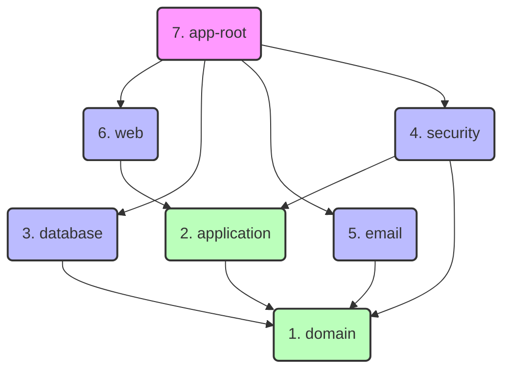

# System Architecture: N-Tier Layered Monolith

The `security-backend` project is designed using a modular monolithic architecture (layered monolith), logically separated into multiple Maven modules. This approach promotes a strict separation of concerns and dependency injection, favoring maintainability, scalability, and code clarity based heavily on concepts from Hexagonal Architecture / Clean Architecture.

In an **N-Tier** architecture, the system is divided into isolated layers. The main rule is that dependencies must always flow in only one direction: from the outermost layers (web, database) towards the innermost layer (domain).

---

## 📦 Main Modules and their Roles

Below is the detailed responsibility of each module in the system:

### 1. `domain` (The Core)
This is the innermost and most agnostic module. It is the heart of the application.
- **Contains:** Pure domain entities (POJOs, Records), enumerations, business exceptions, and "Ports" (interfaces) that will be implemented by external adapters (like repository contracts).
- **Dependencies:** None (only standard Java libraries). It must **never** know about Spring, Databases, or the Web.

### 2. `application` (Use Cases)
Responsible for orchestrating the business logic.
- **Contains:** Implementation of use cases, application services, and interfaces defining external operations if they exist. Business validations and processes that affect domain entities are executed here.
- **Dependencies:** Primarily depends on `domain`. Uses `spring-context` for dependency injection (`@Service`).

### 3. `database` (Data Persistence)
Acts as the adapter for the data access layer.
- **Contains:** JPA Entities (`@Entity`), Spring Data Repositories, and the required mappers to adapt database entities to `domain` objects and vice versa. The interfaces (Ports) defined in the `domain` are implemented here.
- **Dependencies:** `domain` (to implement interfaces and map data). Indirectly might know about `application` if required. Relies on *spring-boot-starter-data-jpa*.

### 4. `security` (Security Isolation)
Centralizes security configurations and filters.
- **Contains:** `SecurityConfig` class, JWT Filters, CORS handling, strict `UserDetails` implementation for Spring Security, and authentication providers.
- **Dependencies:** `domain` and `application` (to search and identify users internally). Relies on *spring-boot-starter-security*.

### 5. `email` (Email Service Adapter)
Acts as the adapter for external email service providers.
- **Contains:** Implementations of the `EmailServicePort` interface defined in `domain`, email provider properties and configuration classes. Supports multiple providers (SendGrid for production, SMTP/MailHog for development).
- **Dependencies:** `domain` (to implement the email port). Relies on *spring-boot-starter-mail* and *sendgrid-java*.

### 6. `web` (Entry Point / API Presentation Layer)
The visible face of the system towards external consumers.
- **Contains:** Spring MVC Controllers (`@RestController`), Data Transfer Objects (DTOs) for requests and responses, endpoint validations, and Swagger/OpenAPI annotations for API documentation.
- **Dependencies:** `application` (to execute use cases). **Note:** Does NOT depend on `security` - authorization rules are centralized in `SecurityConfig` within the `security` module, following hexagonal architecture principles. Relies on *spring-boot-starter-web* and *springdoc-openapi*.

### 7. `app-root` (Bootstrap / Initializer)
Configuration module that enables compilation and execution by assembling the entire system.
- **Contains:** Only the main class with `@SpringBootApplication` and global properties configurations (`application.properties` or `.yml`).
- **Dependencies:** Depends on **absolutely all** other modules and runtime libraries (e.g., Database Drivers). It strings everything together into a single JAR/WAR artifact managed by the Spring Container.

---

## 🔄 Relationships and Interactions (Dependency Flow)

### Explaining the Flow:
1. A request hits a `@RestController` in the **`web`** module.
2. The **`security`** module (configured in `app-root`) intercepts it first to validate JWT tokens and enforce authorization rules defined in `SecurityConfig` using `.requestMatchers()` and role-based access control.
3. The Controller receives the request (adapted from a DTO) and invokes a service from the **`application`** module.
4. **`application`** orchestrates the business logic utilizing classes and rules located in the **`domain`**.
5. If `application` needs to retrieve or persist data, it will use a repository interface (Port) imported from `domain`.
6. At runtime (Spring Injection), the container injects the implementation of that interface which was created and exists exclusively within the **`database`** module.
7. If `application` needs to send emails, it will use the `EmailServicePort` interface from `domain`.
8. At runtime, the container injects the appropriate implementation from the **`email`** module (SendGrid or SMTP based on configuration).
9. If `application` needs to obtain authenticated user information, it will use the `AuthenticationFacadePort` interface from `domain`, implemented by the **`security`** module.
10. All of the above is possible because the **`app-root`** module imports all dependencies in its `pom.xml`, enabling implicit classpath injection across the system in a single embedded startup environment.

**Important:** The **`web`** module has NO compile-time dependency on **`security`**. This ensures proper adapter decoupling following hexagonal architecture principles. Security filters and authentication/authorization are applied at runtime through Spring's filter chain, configured centrally in the `security` module.
