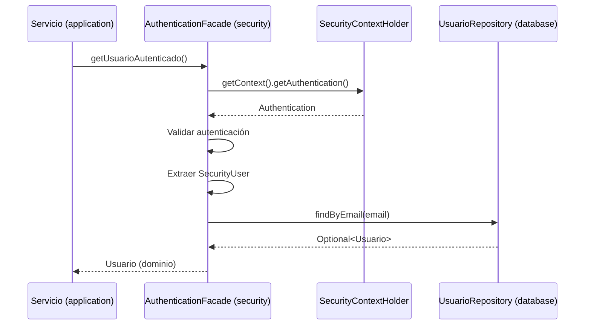

# Migración: AuthenticationFacade (Abstracción de Usuario Autenticado)

**Fecha de migración**: 16/03/2026  
**Estado**: ✅ Completado  
**Prioridad**: Media  
**Módulos afectados**: `domain`, `security`

---

## 📋 Resumen

Se ha implementado el patrón **Facade** para centralizar el acceso al usuario autenticado actual, abstrayendo completamente los detalles de implementación de Spring Security (`SecurityContextHolder`, `Authentication`, etc.) de las capas superiores.

## 🎯 Objetivos Cumplidos

✅ Desacoplar los servicios de aplicación de Spring Security  
✅ Mejorar la testabilidad mediante inyección de dependencias  
✅ Centralizar la lógica de obtención del usuario autenticado  
✅ Facilitar el mantenimiento y cambios futuros en autenticación  
✅ Seguir estrictamente la arquitectura hexagonal

## 🏗️ Arquitectura Implementada

### Módulo: `domain`

**Puerto creado**: `AuthenticationFacadePort`
- **Ubicación**: `domain/src/main/java/com/matias/domain/port/AuthenticationFacadePort.java`
- **Tipo**: Interfaz (Puerto)
- **Métodos**:
  - `Usuario getUsuarioAutenticado()`: Retorna el usuario completo del dominio
  - `String getEmailUsuarioAutenticado()`: Método de conveniencia para obtener solo el email
  - `Integer getIdUsuarioAutenticado()`: Método de conveniencia para obtener solo el ID

**Características**:
- Puerto puro sin dependencias de frameworks
- Retorna objetos del dominio (`Usuario`)
- Lanza `NoAutenticadoException` si no hay usuario autenticado
- Javadoc completo con beneficios y casos de uso

### Módulo: `security`

**Adaptador creado**: `AuthenticationFacadeImpl`
- **Ubicación**: `security/src/main/java/com/matias/security/service/AuthenticationFacadeImpl.java`
- **Tipo**: Implementación del puerto (Adaptador)
- **Anotaciones**: `@Service` (Spring)

**Implementación**:
```java
@Service
public class AuthenticationFacadeImpl implements AuthenticationFacadePort {
    
    private final UsuarioRepositoryPort usuarioRepository;
    
    @Override
    public Usuario getUsuarioAutenticado() {
        Authentication auth = SecurityContextHolder.getContext().getAuthentication();
        
        if (auth == null || !auth.isAuthenticated() || 
            auth.getPrincipal().equals("anonymousUser")) {
            throw new NoAutenticadoException("No hay usuario autenticado");
        }
        
        SecurityUser securityUser = (SecurityUser) auth.getPrincipal();
        return usuarioRepository.findByEmail(securityUser.getUsername())
            .orElseThrow(() -> new NoAutenticadoException("Usuario no encontrado en el sistema"));
    }
    
    @Override
    public String getEmailUsuarioAutenticado() {
        return getUsuarioAutenticado().getEmail();
    }
    
    @Override
    public Integer getIdUsuarioAutenticado() {
        return getUsuarioAutenticado().getId();
    }
}
```

## 🔄 Flujo de Ejecución



## 📊 Comparación: Antes vs. Después

### ❌ Antes (Acceso directo a SecurityContext)

```java
@Service
public class UsuarioServiceImpl implements UsuarioService {
    
    private final UsuarioRepositoryPort usuarioRepository;
    
    public UsuarioResponse obtenerPerfilActual() {
        // ❌ Acoplamiento directo con Spring Security
        Authentication auth = SecurityContextHolder.getContext().getAuthentication();
        SecurityUser securityUser = (SecurityUser) auth.getPrincipal();
        String email = securityUser.getUsername();
        
        // ❌ Lógica duplicada en cada servicio que necesita el usuario
        Usuario usuario = usuarioRepository.findByEmail(email)
            .orElseThrow(() -> new NoAutenticadoException("Usuario no encontrado"));
        
        return UsuarioMapper.toResponse(usuario);
    }
}
```

**Problemas**:
- Acoplamiento directo con Spring Security
- Lógica duplicada en múltiples servicios
- Difícil de testear (mockear `SecurityContextHolder` es complejo)
- Violación del principio de inversión de dependencias

### ✅ Después (Usando AuthenticationFacade)

```java
@Service
public class UsuarioServiceImpl implements UsuarioService {
    
    private final AuthenticationFacadePort authenticationFacade;
    
    public UsuarioResponse obtenerPerfilActual() {
        // ✅ Desacoplado, testeable y simple
        Usuario usuario = authenticationFacade.getUsuarioAutenticado();
        return UsuarioMapper.toResponse(usuario);
    }
}
```

**Beneficios**:
- ✅ Desacoplamiento total de Spring Security
- ✅ Código más limpio y legible
- ✅ Fácil de testear (simple mock del puerto)
- ✅ Lógica centralizada en un solo lugar
- ✅ Cumple con arquitectura hexagonal

## 🧪 Testing

### Test Unitario del Servicio (Con Mock)

```java
@ExtendWith(MockitoExtension.class)
class UsuarioServiceImplTest {
    
    @Mock
    private AuthenticationFacadePort authenticationFacade;
    
    @InjectMocks
    private UsuarioServiceImpl usuarioService;
    
    @Test
    void obtenerPerfilActual_deberiaRetornarUsuario() {
        // Given
        Usuario usuario = Usuario.builder()
            .id(1)
            .email("test@example.com")
            .nombre("Test")
            .build();
        
        when(authenticationFacade.getUsuarioAutenticado()).thenReturn(usuario);
        
        // When
        UsuarioResponse response = usuarioService.obtenerPerfilActual();
        
        // Then
        assertNotNull(response);
        assertEquals("test@example.com", response.email());
        verify(authenticationFacade).getUsuarioAutenticado();
    }
}
```

### Test de Integración del Adaptador

```java
@SpringBootTest
@AutoConfigureMockMvc
class AuthenticationFacadeIntegrationTest {
    
    @Autowired
    private AuthenticationFacadePort authenticationFacade;
    
    @Test
    @WithMockUser(username = "test@example.com")
    void getUsuarioAutenticado_conUsuarioAutenticado_deberiaRetornarUsuario() {
        // When
        Usuario usuario = authenticationFacade.getUsuarioAutenticado();
        
        // Then
        assertNotNull(usuario);
        assertEquals("test@example.com", usuario.getEmail());
    }
    
    @Test
    void getUsuarioAutenticado_sinAutenticacion_deberiaLanzarExcepcion() {
        // When & Then
        assertThrows(NoAutenticadoException.class, 
            () -> authenticationFacade.getUsuarioAutenticado());
    }
}
```

## 📝 Casos de Uso

### 1. Obtener perfil del usuario actual

```java
@Service
public class UsuarioServiceImpl implements UsuarioService {
    private final AuthenticationFacadePort authenticationFacade;
    
    public UsuarioResponse obtenerPerfil() {
        Usuario usuario = authenticationFacade.getUsuarioAutenticado();
        return UsuarioMapper.toResponse(usuario);
    }
}
```

### 2. Validar permisos de operación

```java
@Service
public class DocumentoServiceImpl implements DocumentoService {
    private final AuthenticationFacadePort authenticationFacade;
    private final DocumentoRepositoryPort documentoRepository;
    
    public void eliminarDocumento(Integer documentoId) {
        Integer usuarioId = authenticationFacade.getIdUsuarioAutenticado();
        Documento documento = documentoRepository.findById(documentoId)
            .orElseThrow(() -> new RecursoNoEncontradoException("Documento no encontrado"));
        
        if (!documento.getPropietarioId().equals(usuarioId)) {
            throw new AccesoDenegadoException("No tiene permisos para eliminar este documento");
        }
        
        documentoRepository.delete(documentoId);
    }
}
```

### 3. Auditoría de operaciones

```java
@Service
public class AuditoriaServiceImpl implements AuditoriaService {
    private final AuthenticationFacadePort authenticationFacade;
    private final AuditLogRepositoryPort auditLogRepository;
    
    public void registrarOperacion(String operacion, String detalles) {
        String emailUsuario = authenticationFacade.getEmailUsuarioAutenticado();
        
        AuditLog log = AuditLog.builder()
            .operacion(operacion)
            .usuario(emailUsuario)
            .detalles(detalles)
            .fecha(Instant.now())
            .build();
        
        auditLogRepository.save(log);
    }
}
```

## 🎯 Principios de Arquitectura Hexagonal Cumplidos

### ✅ Inversión de Dependencias
- El dominio define el puerto (`AuthenticationFacadePort`)
- La infraestructura (`security`) implementa el adaptador
- Los servicios de aplicación dependen del puerto, no de la implementación

### ✅ Separación de Responsabilidades
- **Domain**: Define el contrato (puerto)
- **Security**: Implementa la lógica de Spring Security
- **Application**: Usa el puerto sin conocer implementación

### ✅ Testabilidad
- Los servicios pueden testearse con mocks simples del puerto
- No es necesario mockear `SecurityContextHolder` en tests unitarios
- Tests de integración solo en el módulo `security`

### ✅ Mantenibilidad
- Cambios en Spring Security solo afectan al módulo `security`
- Los servicios de aplicación permanecen estables
- Punto único de cambio para la lógica de autenticación

## ⚠️ Consideraciones Importantes

### 1. Rendimiento
- Cada llamada a `getUsuarioAutenticado()` realiza una consulta a base de datos
- Para operaciones que requieren múltiples accesos, cachear el resultado:

```java
public void operacionCompleja() {
    Usuario usuario = authenticationFacade.getUsuarioAutenticado(); // Una sola consulta
    
    // Usar 'usuario' múltiples veces
    validarPermisos(usuario);
    registrarOperacion(usuario);
    enviarNotificacion(usuario);
}
```

### 2. Contextos sin Autenticación
- Tareas programadas (schedulers)
- Procesos batch
- Listeners de eventos

**Solución**: Usar un usuario del sistema o capturar el usuario antes de operaciones asíncronas.

### 3. Operaciones Asíncronas
- `SecurityContextHolder` no se propaga automáticamente a hilos secundarios
- Usar `SecurityContextHolder.setContext()` o `@Async` con configuración específica

## 📚 Referencias

- **Patrón Facade**: [Gang of Four Design Patterns](https://refactoring.guru/design-patterns/facade)
- **Hexagonal Architecture**: [Alistair Cockburn](https://alistair.cockburn.us/hexagonal-architecture/)
- **Spring Security Context**: [Spring Docs](https://docs.spring.io/spring-security/reference/servlet/authentication/architecture.html)

## ✅ Checklist de Implementación

- [x] **Domain**: Crear `AuthenticationFacadePort` (interfaz)
- [x] **Security**: Crear `AuthenticationFacadeImpl` (implementación)
- [x] **Compilation**: Verificar que compila correctamente
- [x] **Documentation**: Crear documento de migración
- [ ] **Application**: Refactorizar servicios existentes para usar el puerto (pendiente)
- [ ] **Testing**: Crear tests unitarios del adaptador (pendiente)
- [ ] **Testing**: Crear tests de integración (pendiente)

## 🔜 Próximos Pasos

1. **Refactorizar servicios existentes**: Identificar y actualizar servicios que acceden directamente a `SecurityContextHolder`
2. **Implementar tests**: Crear suite completa de tests unitarios e integración
3. **Documentar uso**: Agregar ejemplos de uso en la documentación del proyecto
4. **Code review**: Revisar código existente para asegurar consistencia

---

**Conclusión**: La implementación del `AuthenticationFacade` es un paso fundamental en la consolidación de la arquitectura hexagonal del proyecto. Proporciona un punto de acceso consistente y desacoplado al usuario autenticado, mejorando significativamente la testabilidad, mantenibilidad y claridad del código.
