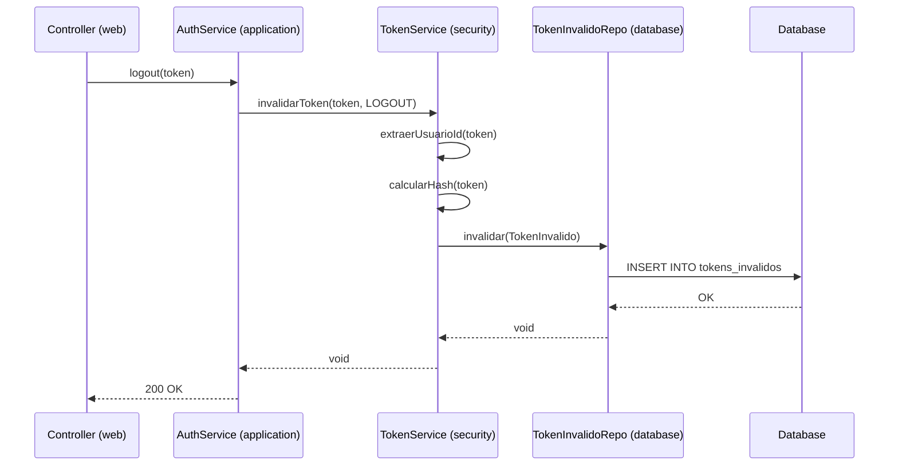

# Plan de Migración de Funcionalidades Pendientes

Este documento presenta un plan detallado y priorizado para migrar las funcionalidades restantes del proyecto `seguridad-back` a `security-backend`, siguiendo estrictamente los principios de la **arquitectura hexagonal** definida en `docs/architecture.md`.

## 📋 Índice de Funcionalidades

1. [Sistema de Token Invalidación](#1-sistema-de-token-invalidación)
2. [AuthenticationFacade](#2-authenticationfacade)
3. [Utilidades de Normalización de Datos](#3-utilidades-de-normalización-de-datos)
4. [Validadores Adicionales](#4-validadores-adicionales)
5. [UsuarioSpecification para Filtros Dinámicos](#5-usuariospecification-para-filtros-dinámicos)
6. [Sistema de Roles como Entidad Separada](#6-sistema-de-roles-como-entidad-separada)
7. [AdminController Completo con Estadísticas](#7-admincontroller-completo-con-estadísticas)
8. [Swagger/OpenAPI Configuration](#8-swaggeropenapi-configuration)
9. [Sistema de Auditoría con Historial de Cambios](#9-sistema-de-auditoría-con-historial-de-cambios)

---

## 1. Sistema de Token Invalidación ✅ COMPLETADO

> **Estado**: ✅ Migrado exitosamente el 16/03/2026  
> **Documentación**: Ver [`docs/migrations/token-invalidation-migration.md`](./token-invalidation-migration.md)

### 🎯 Objetivo
Implementar un sistema robusto para gestionar tokens JWT revocados/invalidados, permitiendo logout efectivo, invalidación por cambio de contraseña, rotación de tokens y bloqueo de usuarios.

### 📊 Análisis del Sistema Actual (seguridad-back)

**Componentes:**
- `TokenInvalidoEntity`: Entidad JPA con hash del token, fecha de expiración y motivo
- `MotivoInvalidacionToken`: Enum con `LOGOUT`, `CAMBIO_PASSWORD`, `ROTACION`, `USUARIO_BANEADO`
- `TokenInvalidoRepository`: Repositorio Spring Data JPA

**Características:**
- Almacena token completo + hash SHA-256
- Validación en `@PrePersist` para integridad de datos
- Asociación con usuario para auditoría
- Limpieza automática de tokens expirados (scheduler)

### 🏗️ Diseño según Arquitectura Hexagonal

#### **Módulo: `domain`**
```
domain/src/main/java/com/matias/domain/
├── model/
│   ├── TokenInvalido.java                    // Modelo de dominio puro
│   └── MotivoInvalidacionToken.java          // Enum del dominio
└── port/
    └── TokenInvalidoRepositoryPort.java      // Puerto (interfaz)
```

**Contenido:**
- `TokenInvalido`: Record/POJO con `id`, `tokenHash`, `expiracion`, `fechaInvalidacion`, `motivo`, `usuarioId`
- `MotivoInvalidacionToken`: Enum con los 4 motivos
- `TokenInvalidoRepositoryPort`: Interfaz con métodos:
  - `void invalidar(TokenInvalido token)`
  - `boolean existeTokenInvalido(String tokenHash)`
  - `void eliminarTokensExpirados()`
  - `List<TokenInvalido> buscarPorUsuario(Integer usuarioId)`

#### **Módulo: `database`**
```
database/src/main/java/com/matias/database/
├── entity/
│   └── TokenInvalidoEntity.java              // Entidad JPA
├── repository/
│   └── TokenInvalidoJpaRepository.java       // Spring Data JPA Repository
├── adapter/
│   └── TokenInvalidoRepositoryAdapter.java   // Implementa el puerto
└── mapper/
    └── TokenInvalidoMapper.java              // Mapea Entity <-> Domain
```

**Responsabilidades:**
- `TokenInvalidoEntity`: Copia exacta del original con `@Entity`, validaciones `@PrePersist`
- `TokenInvalidoJpaRepository`: 
  - `boolean existsByTokenHash(String hash)`
  - `void deleteByExpiracionBefore(Instant fecha)`
- `TokenInvalidoRepositoryAdapter`: Implementa `TokenInvalidoRepositoryPort` usando el JPA repo
- `TokenInvalidoMapper`: Conversiones bidireccionales

#### **Módulo: `security`**
```
security/src/main/java/com/matias/security/
└── jwt/
    └── TokenServiceImpl.java                 // Extender con lógica de invalidación
```

**Integración:**
- Método `invalidarToken(String token, MotivoInvalidacionToken motivo)`
- En `validateToken()` verificar si el token está invalidado antes de validar firma
- Calcular SHA-256 del token para búsqueda eficiente

#### **Módulo: `application`**
```
application/src/main/java/com/matias/application/
├── service/
│   ├── AuthService.java                      // Agregar método logout
│   └── PasswordResetService.java             // Invalidar tokens al cambiar password
└── scheduled/
    └── LimpiezaDatosScheduler.java           // Agregar limpieza de tokens inválidos
```

**Casos de uso:**
- `logout()`: Invalidar token actual con motivo LOGOUT
- `resetPassword()`: Invalidar todos los tokens del usuario con motivo CAMBIO_PASSWORD
- `banearUsuario()`: Invalidar todos los tokens con motivo USUARIO_BANEADO

#### **Módulo: `web`**
```
web/src/main/java/com/matias/web/
└── controller/
    └── AuthController.java                   // Endpoint POST /auth/logout
```

### ✅ Checklist de Implementación

- [x] **Domain**: Crear `TokenInvalido` (modelo)
- [x] **Domain**: Crear `MotivoInvalidacionToken` (enum)
- [x] **Domain**: Crear `TokenInvalidoRepositoryPort` (interfaz)
- [x] **Database**: Crear `TokenInvalidoEntity` (con validaciones)
- [x] **Database**: Crear `TokenInvalidoJpaRepository`
- [x] **Database**: Crear `TokenInvalidoMapper`
- [x] **Database**: Crear `TokenInvalidoRepositoryAdapter`
- [x] **Security**: Extender `TokenServicePort` con métodos de invalidación
- [x] **Security**: Implementar métodos en `TokenServiceImpl`
- [x] **Application**: Agregar método `logout()` en `AuthService`
- [x] **Application**: Agregar limpieza en `LimpiezaDatosScheduler`
- [ ] **Security**: Integrar verificación en `JwtFilter` (pendiente)
- [ ] **Application**: Invalidar tokens en `PasswordResetService` (pendiente)
- [ ] **Web**: Crear endpoint `POST /auth/logout` (pendiente)
- [ ] **Testing**: Crear tests unitarios e integración (pendiente)
- [ ] **Database**: Crear migration SQL para tabla `tokens_invalidos` (pendiente)

### 📝 Notas de Implementación

La funcionalidad core ha sido implementada exitosamente siguiendo la arquitectura hexagonal:
- ✅ Modelo de dominio completamente independiente de frameworks
- ✅ Puerto definido en `domain` implementado en `database`
- ✅ Servicio de invalidación en capa `security`
- ✅ Integración en `AuthService` para logout
- ✅ Limpieza automática de tokens expirados

**Pendientes para completar 100%:**
1. Actualizar `JwtFilter` para verificar tokens invalidados en cada request
2. Integrar invalidación en cambio de contraseña
3. Exponer endpoint REST en `AuthController`
4. Crear migration SQL para la tabla
5. Implementar tests

### 🔄 Flujo de Ejecución



### ⚠️ Consideraciones Técnicas

1. **Performance**: Usar índice en `token_hash` para búsquedas rápidas
2. **Storage**: Considerar limpieza agresiva (ej: cada 1 hora) para tokens expirados
3. **Seguridad**: Nunca exponer el token completo en logs, solo el hash
4. **Escalabilidad**: Para millones de usuarios, considerar Redis en lugar de DB relacional

---

## 2. AuthenticationFacade ✅ COMPLETADO

> **Estado**: ✅ Migrado exitosamente el 16/03/2026  
> **Documentación**: Ver [`docs/migrations/authentication-facade-migration.md`](./authentication-facade-migration.md)

### 🎯 Objetivo
Centralizar el acceso al usuario autenticado actual, abstrayendo `SecurityContextHolder` para obtener información del usuario de forma segura y consistente en toda la aplicación.

### 📊 Análisis del Sistema Actual (seguridad-back)

**Componentes:**
- `AuthenticationFacade`: Interfaz con 3 métodos principales
- `AuthenticationFacadeImpl`: Implementación que usa `SecurityContextHolder`

**Métodos:**
- `getUsuarioAutenticado()`: Retorna `UsuarioEntity` completo
- `getEmailUsuarioAutenticado()`: Retorna email
- `getIdUsuarioAutenticado()`: Retorna ID

### 🏗️ Diseño según Arquitectura Hexagonal

#### **Módulo: `domain`**
```
domain/src/main/java/com/matias/domain/
└── port/
    └── AuthenticationFacadePort.java         // Puerto (interfaz)
```

**Contenido:**
- Interfaz con los 3 métodos pero retornando objetos del `domain`:
  - `Usuario getUsuarioAutenticado()`
  - `String getEmailUsuarioAutenticado()`
  - `Integer getIdUsuarioAutenticado()`

#### **Módulo: `security`**
```
security/src/main/java/com/matias/security/
└── service/
    └── AuthenticationFacadeImpl.java         // Implementa el puerto
```

**Responsabilidades:**
- Implementar `AuthenticationFacadePort`
- Acceder a `SecurityContextHolder.getContext().getAuthentication()`
- Extraer `SecurityUser` del `Principal`
- Inyectar `UsuarioRepositoryPort` para obtener `Usuario` del dominio
- Lanzar `NoAutenticadoException` si no hay usuario autenticado

**Implementación sugerida:**
```java
@Service
public class AuthenticationFacadeImpl implements AuthenticationFacadePort {
    
    private final UsuarioRepositoryPort usuarioRepository;
    
    @Override
    public Usuario getUsuarioAutenticado() {
        Authentication auth = SecurityContextHolder.getContext().getAuthentication();
        
        if (auth == null || !auth.isAuthenticated() || 
            auth.getPrincipal().equals("anonymousUser")) {
            throw new NoAutenticadoException("No hay usuario autenticado");
        }
        
        SecurityUser securityUser = (SecurityUser) auth.getPrincipal();
        return usuarioRepository.buscarPorEmail(securityUser.getUsername())
            .orElseThrow(() -> new NoAutenticadoException("Usuario no encontrado"));
    }
    
    @Override
    public String getEmailUsuarioAutenticado() {
        return getUsuarioAutenticado().getEmail();
    }
    
    @Override
    public Integer getIdUsuarioAutenticado() {
        return getUsuarioAutenticado().getId();
    }
}
```

#### **Módulo: `application`**

**Uso en servicios:**
- Inyectar `AuthenticationFacadePort` en lugar de acceder directamente a `SecurityContextHolder`
- Usar en `UsuarioService`, `AdminService`, etc.

### ✅ Checklist de Implementación

- [x] **Domain**: Crear `AuthenticationFacadePort` (interfaz)
- [x] **Security**: Crear `AuthenticationFacadeImpl`
- [x] **Compilation**: Verificar que compila correctamente
- [x] **Documentation**: Crear documento de migración
- [ ] **Application**: Refactorizar servicios existentes para usar el puerto (pendiente)
- [ ] **Testing**: Crear tests unitarios e integración (pendiente)

### 🎯 Beneficios

1. **Desacoplamiento**: Servicios no conocen Spring Security
2. **Testabilidad**: Fácil mockear para tests
3. **Consistencia**: Un solo punto para obtener usuario autenticado
4. **Mantenibilidad**: Cambios en autenticación se hacen en un solo lugar

---

## 3. Utilidades de Normalización de Datos

### 🎯 Objetivo
Implementar un sistema robusto de normalización de datos (nombres, emails, teléfonos, direcciones) para garantizar consistencia en la entrada de información de usuarios.

### 📊 Análisis del Sistema Actual (seguridad-back)

**Componentes:**
- `DataNormalizer`: Clase utilitaria con múltiples métodos de normalización
- `UsuarioUtil`: Utilidades específicas para usuarios

**Funcionalidades de DataNormalizer:**
- Normalización de nombres propios (Title Case)
- Normalización de apellidos (con prefijos culturales: von, de, mc, o', etc.)
- Normalización de emails (lowercase)
- Normalización de usernames (lowercase sin espacios)
- Normalización de direcciones (Title Case preservando números)
- Normalización de teléfonos (digits only / formatted)
- Normalización de texto general

### 🏗️ Diseño según Arquitectura Hexagonal

#### **Módulo: `domain`**
```
domain/src/main/java/com/matias/domain/
└── util/
    └── DataNormalizer.java                   // Clase utilitaria del dominio
```

**Justificación:**
- Es lógica de negocio pura (no depende de frameworks)
- No tiene estado (stateless utility class)
- Puede ser usado por cualquier capa sin crear dependencias

**IMPORTANTE**: **NO** anotar con `@Component` ya que está en el módulo `domain`. La clase debe ser estática o instanciable manualmente.

**Alternativa pragmática:**
```java
public final class DataNormalizer {
    private DataNormalizer() {
        throw new UnsupportedOperationException("Utility class");
    }
    
    public static String normalizeProperName(String input) { ... }
    public static String normalizeLastName(String input) { ... }
    // ... resto de métodos estáticos
}
```

#### **Módulo: `application`**

**Uso en servicios:**
- Importar estáticamente los métodos
- Usar en `AuthService`, `UsuarioService` al crear/actualizar usuarios
- Ejemplo: 
  ```java
  String nombreNormalizado = DataNormalizer.normalizeProperName(request.nombre());
  ```

#### **Alternativa si se prefiere IoC (Enfoque Pragmático):**

Si se desea usar inyección de dependencias (más testeable):

**Módulo: `application`**
```
application/src/main/java/com/matias/application/
└── util/
    └── DataNormalizer.java                   // @Component aquí
```

Anotar con `@Component` y usar inyección de dependencias en servicios.

### ✅ Checklist de Implementación

- [ ] **Domain**: Crear `DataNormalizer` como utility class estática
- [ ] **Application**: Integrar en `AuthService.registrar()` para normalizar datos
- [ ] **Application**: Integrar en `UsuarioService.actualizarPerfil()`
- [ ] **Testing**: Crear tests unitarios para cada método de normalización
- [ ] **Documentation**: Documentar casos de uso y ejemplos

### 📝 Casos de Uso Principales

1. **Registro de usuario**: Normalizar nombre, apellido, email antes de persistir
2. **Actualización de perfil**: Normalizar campos editables
3. **Búsqueda**: Normalizar términos de búsqueda para consistencia

---

## 4. Validadores Adicionales

### 🎯 Objetivo
Implementar validadores personalizados de Bean Validation para tipos de datos específicos: alfanuméricos, numéricos, caracteres, con y sin espacios.

### 📊 Análisis del Sistema Actual (seguridad-back)

**Validadores disponibles:**
1. `@AlphanumericWithoutWhiteSpaces`: Solo letras y números
2. `@AlphanumericWithWhiteSpaces`: Letras, números y espacios
3. `@CharactersWithoutWhiteSpaces`: Solo letras (sin números)
4. `@CharactersWithWhiteSpaces`: Solo letras y espacios
5. `@NumericWithoutWhiteSpaces`: Solo números
6. `@NumericWithWhiteSpaces`: Números y espacios

Cada validador tiene:
- Anotación con `message`, `groups`, `payload`
- Clase Validator que implementa `ConstraintValidator`

### 🏗️ Diseño según Arquitectura Hexagonal

#### **Módulo: `application`**
```
application/src/main/java/com/matias/application/
└── validation/
    ├── AlphanumericWithoutWhiteSpaces.java
    ├── AlphanumericWithoutWhiteSpacesValidator.java
    ├── AlphanumericWithWhiteSpaces.java
    ├── AlphanumericWithWhiteSpacesValidator.java
    ├── CharactersWithoutWhiteSpaces.java
    ├── CharactersWithoutWhiteSpacesValidator.java
    ├── CharactersWithWhiteSpaces.java
    ├── CharactersWithWhiteSpacesValidator.java
    ├── NumericWithoutWhiteSpaces.java
    ├── NumericWithoutWhiteSpacesValidator.java
    ├── NumericWithWhiteSpaces.java
    └── NumericWithWhiteSpacesValidator.java
```

**Justificación:**
- Son validaciones de entrada (capa de aplicación)
- Ya existe `Password` y `CharactersWithWhiteSpaces` en este módulo
- Consistencia con la estructura actual

**Implementación tipo:**
```java
@Documented
@Constraint(validatedBy = AlphanumericWithoutWhiteSpacesValidator.class)
@Target({ElementType.FIELD, ElementType.PARAMETER})
@Retention(RetentionPolicy.RUNTIME)
public @interface AlphanumericWithoutWhiteSpaces {
    String message() default "Solo se permiten caracteres alfanuméricos";
    Class<?>[] groups() default {};
    Class<? extends Payload>[] payload() default {};
}

public class AlphanumericWithoutWhiteSpacesValidator 
    implements ConstraintValidator<AlphanumericWithoutWhiteSpaces, String> {
    
    private static final Pattern PATTERN = Pattern.compile("^[a-zA-Z0-9]+$");
    
    @Override
    public boolean isValid(String value, ConstraintValidatorContext context) {
        if (value == null || value.isBlank()) {
            return true; // Usar @NotBlank para validar nulos
        }
        return PATTERN.matcher(value).matches();
    }
}
```

#### **Módulo: `web`**

**Uso en DTOs:**
- Aplicar en DTOs de request según necesidad
- Ejemplo: username podría usar `@AlphanumericWithoutWhiteSpaces`

### ✅ Checklist de Implementación

- [ ] **Application**: Crear `@AlphanumericWithoutWhiteSpaces` + Validator
- [ ] **Application**: Crear `@AlphanumericWithWhiteSpaces` + Validator
- [ ] **Application**: Crear `@NumericWithoutWhiteSpaces` + Validator
- [ ] **Application**: Crear `@NumericWithWhiteSpaces` + Validator
- [ ] **Web**: Aplicar validadores en DTOs correspondientes
- [ ] **Testing**: Tests unitarios para cada validador
- [ ] **Documentation**: Documentar uso de validadores

### 📋 Tabla de Validadores

| Validador | Pattern | Ejemplo válido | Ejemplo inválido |
|-----------|---------|----------------|------------------|
| AlphanumericWithoutWhiteSpaces | `^[a-zA-Z0-9]+$` | `usuario123` | `usuario 123` |
| AlphanumericWithWhiteSpaces | `^[a-zA-Z0-9\\s]+$` | `usuario 123` | `usuario@123` |
| CharactersWithoutWhiteSpaces | `^[a-zA-Z]+$` | `usuario` | `usuario123` |
| CharactersWithWhiteSpaces | `^[a-zA-Z\\s]+$` | `nombre completo` | `nombre123` |
| NumericWithoutWhiteSpaces | `^[0-9]+$` | `123456` | `123 456` |
| NumericWithWhiteSpaces | `^[0-9\\s]+$` | `123 456` | `123-456` |

---

## 5. UsuarioSpecification para Filtros Dinámicos

### 🎯 Objetivo
Implementar un sistema de filtros dinámicos usando JPA Criteria API y Spring Data Specifications para búsquedas avanzadas de usuarios.

### 📊 Análisis del Sistema Actual (seguridad-back)

**Componentes:**
- `UsuarioSpecification`: Clase utilitaria con método estático `conFiltros()`
- `UsuarioFilterRequest`: DTO con criterios de filtrado

**Filtros disponibles:**
- `search`: Búsqueda por email, nombre o apellido (LIKE)
- `activo`: Filtro por estado (Boolean)
- `emailVerificado`: Filtro por verificación (Boolean)
- `roles`: Filtro por roles (IN clause con JOIN)
- `fechaDesde` / `fechaHasta`: Rango de fechas de creación

### 🏗️ Diseño según Arquitectura Hexagonal

#### **Módulo: `web`**
```
web/src/main/java/com/matias/web/
└── dto/
    └── request/
        └── UsuarioFilterRequest.java         // DTO de request
```

**Contenido:**
```java
public record UsuarioFilterRequest(
    String search,
    Boolean activo,
    Boolean emailVerificado,
    Set<Rol> roles,
    Instant fechaDesde,
    Instant fechaHasta
) {}
```

#### **Módulo: `database`**
```
database/src/main/java/com/matias/database/
└── specification/
    └── UsuarioSpecification.java             // JPA Criteria Builder
```

**Justificación:**
- Es infraestructura de persistencia (JPA Criteria API)
- Trabaja directamente con `UsuarioEntity` (no modelo de dominio)
- Específico de Spring Data JPA

**Implementación:**
```java
public class UsuarioSpecification {

    private UsuarioSpecification() {
        throw new UnsupportedOperationException("Utility class");
    }

    public static Specification<UsuarioEntity> conFiltros(UsuarioFilterRequest filtros) {
        return (root, query, cb) -> {
            List<Predicate> predicates = new ArrayList<>();

            // Search (email, nombre, apellido)
            if (filtros.search() != null && !filtros.search().isBlank()) {
                String pattern = "%" + filtros.search().toLowerCase() + "%";
                predicates.add(cb.or(
                    cb.like(cb.lower(root.get("email")), pattern),
                    cb.like(cb.lower(root.get("nombre")), pattern),
                    cb.like(cb.lower(root.get("apellido")), pattern)
                ));
            }

            // Filtro por activo
            if (filtros.activo() != null) {
                predicates.add(cb.equal(root.get("activo"), filtros.activo()));
            }

            // Filtro por email verificado
            if (filtros.emailVerificado() != null) {
                predicates.add(cb.equal(root.get("emailVerificado"), filtros.emailVerificado()));
            }

            // Filtro por roles (requiere JOIN)
            if (filtros.roles() != null && !filtros.roles().isEmpty()) {
                Join<UsuarioEntity, UsuarioRolEntity> roles = root.join("usuarioRoles");
                predicates.add(roles.get("rol").in(filtros.roles()));
                query.distinct(true); // Evitar duplicados
            }

            // Rango de fechas
            if (filtros.fechaDesde() != null) {
                predicates.add(cb.greaterThanOrEqualTo(root.get("fechaCreacion"), filtros.fechaDesde()));
            }
            if (filtros.fechaHasta() != null) {
                predicates.add(cb.lessThanOrEqualTo(root.get("fechaCreacion"), filtros.fechaHasta()));
            }

            return cb.and(predicates.toArray(Predicate[]::new));
        };
    }
}
```

#### **Módulo: `database`** (Repository)

Extender `UsuarioJpaRepository`:
```java
public interface UsuarioJpaRepository extends 
    JpaRepository<UsuarioEntity, Integer>, 
    JpaSpecificationExecutor<UsuarioEntity> {  // <-- Agregar esto
    // ... métodos existentes
}
```

#### **Módulo: `application`**

**Uso en AdminService:**
```java
@Service
public class AdminServiceImpl implements AdminService {
    
    private final UsuarioJpaRepository usuarioRepository;
    
    public Page<UsuarioListItemResponse> listarUsuarios(
            UsuarioFilterRequest filtros, Pageable pageable) {
        
        Specification<UsuarioEntity> spec = UsuarioSpecification.conFiltros(filtros);
        Page<UsuarioEntity> page = usuarioRepository.findAll(spec, pageable);
        
        return page.map(this::toListItemResponse);
    }
}
```

### ✅ Checklist de Implementación

- [ ] **Web**: Crear `UsuarioFilterRequest` DTO
- [ ] **Database**: Crear `UsuarioSpecification`
- [ ] **Database**: Agregar `JpaSpecificationExecutor` a `UsuarioJpaRepository`
- [ ] **Application**: Implementar método de búsqueda filtrada en `AdminService`
- [ ] **Web**: Crear endpoint `GET /admin/usuarios` con filtros
- [ ] **Testing**: Tests de integración con diferentes combinaciones de filtros
- [ ] **Documentation**: Documentar API de filtros

### 🔍 Ejemplos de Uso

**Request:**
```
GET /admin/usuarios?search=maria&activo=true&roles=USER&fechaDesde=2024-01-01T00:00:00Z&page=0&size=20&sort=fechaCreacion,desc
```

**Resultado:**
- Usuarios cuyo email/nombre/apellido contenga "maria"
- Que estén activos
- Que tengan rol USER
- Creados desde enero 2024
- Paginado y ordenado

---

## 6. Sistema de Roles como Entidad Separada

### 🎯 Objetivo
Migrar el sistema de roles desde un enum embebido en `Usuario` hacia una entidad independiente `UsuarioRol`, permitiendo relación Many-to-Many entre usuarios y roles.

### 📊 Análisis del Sistema Actual

**seguridad-back:**
- `UsuarioRolEntity`: Entidad separada con `@ManyToOne` a `UsuarioEntity`
- `UsuarioRolRepository`: Repository específico
- `UsuarioRolMapper`: Mapper para conversiones

**security-backend (actual):**
- `Usuario.roles`: Set de enum `Rol` almacenado con `@ElementCollection`

### 🏗️ Diseño según Arquitectura Hexagonal

#### **Módulo: `domain`**
```
domain/src/main/java/com/matias/domain/
└── model/
    └── UsuarioRol.java                       // Nuevo modelo de dominio
```

**Contenido:**
```java
public record UsuarioRol(
    Integer id,
    Integer usuarioId,
    Rol rol,
    Instant fechaAsignacion
) {}
```

**Modificar `Usuario.java`:**
```java
public record Usuario(
    // ... campos existentes
    Set<UsuarioRol> usuarioRoles  // En lugar de Set<Rol> roles
) {
    // Helper method
    public Set<Rol> getRoles() {
        return usuarioRoles.stream()
            .map(UsuarioRol::rol)
            .collect(Collectors.toSet());
    }
}
```

#### **Módulo: `database`**
```
database/src/main/java/com/matias/database/
├── entity/
│   └── UsuarioRolEntity.java                 // Nueva entidad JPA
├── repository/
│   └── UsuarioRolJpaRepository.java          // Nuevo repository
└── mapper/
    └── UsuarioRolMapper.java                 // Nuevo mapper
```

**UsuarioRolEntity:**
```java
@Entity
@Table(name = "usuarios_roles")
public class UsuarioRolEntity {
    
    @Id
    @GeneratedValue(strategy = GenerationType.IDENTITY)
    private Integer id;
    
    @ManyToOne(fetch = FetchType.LAZY)
    @JoinColumn(name = "usuario_id", nullable = false)
    private UsuarioEntity usuario;
    
    @Enumerated(EnumType.STRING)
    @Column(nullable = false, length = 50)
    private Rol rol;
    
    @Column(name = "fecha_asignacion", nullable = false)
    private Instant fechaAsignacion;
}
```

**Modificar `UsuarioEntity`:**
```java
@Entity
@Table(name = "usuarios")
public class UsuarioEntity {
    // ... campos existentes
    
    @OneToMany(mappedBy = "usuario", cascade = CascadeType.ALL, orphanRemoval = true)
    private Set<UsuarioRolEntity> usuarioRoles = new HashSet<>();
    
    // Helper method para compatibilidad
    public Set<Rol> getRoles() {
        return usuarioRoles.stream()
            .map(UsuarioRolEntity::getRol)
            .collect(Collectors.toSet());
    }
}
```

### ✅ Checklist de Implementación

- [ ] **Domain**: Crear `UsuarioRol` modelo
- [ ] **Domain**: Modificar `Usuario` para usar `Set<UsuarioRol>`
- [ ] **Database**: Crear `UsuarioRolEntity`
- [ ] **Database**: Crear `UsuarioRolJpaRepository`
- [ ] **Database**: Crear `UsuarioRolMapper`
- [ ] **Database**: Modificar `UsuarioEntity` (relación OneToMany)
- [ ] **Database**: Modificar `UsuarioMapper` para mapear roles correctamente
- [ ] **Database**: Crear migration SQL para tabla `usuarios_roles`
- [ ] **Application**: Ajustar servicios que usan roles
- [ ] **Web**: Crear DTOs de response que incluyan fecha de asignación
- [ ] **Testing**: Actualizar tests existentes

### ⚠️ Consideraciones de Migración

**IMPORTANTE**: Esta es una migración de esquema de base de datos que requiere:

1. **Script de migración**: Migrar datos de `usuario_roles` (ElementCollection) a `usuarios_roles` (entidad separada)
2. **Compatibilidad temporal**: Mantener ambos sistemas temporalmente si es necesario
3. **Indices**: Agregar índice compuesto en `(usuario_id, rol)` para performance

**Script SQL sugerido:**
```sql
-- Crear nueva tabla
CREATE TABLE usuarios_roles (
    id INT AUTO_INCREMENT PRIMARY KEY,
    usuario_id INT NOT NULL,
    rol VARCHAR(50) NOT NULL,
    fecha_asignacion TIMESTAMP NOT NULL DEFAULT CURRENT_TIMESTAMP,
    FOREIGN KEY (usuario_id) REFERENCES usuarios(id) ON DELETE CASCADE,
    UNIQUE KEY uk_usuario_rol (usuario_id, rol),
    INDEX idx_rol (rol)
);

-- Migrar datos existentes
INSERT INTO usuarios_roles (usuario_id, rol, fecha_asignacion)
SELECT u.id, ur.roles, u.fecha_creacion
FROM usuarios u
JOIN usuario_roles ur ON u.id = ur.usuario_id;

-- Después de verificar, eliminar tabla antigua
-- DROP TABLE usuario_roles;
```

---

## 7. AdminController Completo con Estadísticas ✅ COMPLETADO

> **Estado**: ✅ Migrado exitosamente el 17/03/2026  
> **Documentación**: Ver [`docs/migrations/admin-module-migration.md`](./admin-module-migration.md)

### 🎯 Objetivo
Implementar un AdminController completo con endpoints para gestión avanzada de usuarios, estadísticas del sistema y operaciones administrativas.

### 📊 Análisis del Sistema Actual (seguridad-back)

**Endpoints disponibles:**
1. `GET /admin/stats` - Estadísticas generales del sistema
2. `GET /admin/usuarios` - Listado paginado con filtros avanzados
3. `GET /admin/usuarios/{id}` - Detalle completo de un usuario
4. `PATCH /admin/usuarios/{id}/status` - Activar/desactivar usuario
5. `DELETE /admin/usuarios/{id}` - Eliminar usuario (soft/hard delete)

**DTOs específicos:**
- `StatsResponse`: Estadísticas con sub-records (usuarios, verificación, crecimiento, roles)
- `UsuarioListItemResponse`: Versión simplificada para listados
- `UpdateUserStatusRequest`: Para cambiar estado de usuario

### 🏗️ Diseño según Arquitectura Hexagonal

#### **Módulo: `web`**
```
web/src/main/java/com/matias/web/
├── controller/
│   └── AdminController.java                  // Extender con nuevos endpoints
└── dto/
    ├── request/
    │   └── UpdateUserStatusRequest.java      // Nuevo DTO
    └── response/
        ├── StatsResponse.java                // Nuevo DTO con sub-records
        └── UsuarioListItemResponse.java      // Versión ligera
```

**StatsResponse:**
```java
public record StatsResponse(
    UsuariosStats usuarios,
    VerificacionStats verificacion,
    CrecimientoStats crecimiento,
    Map<Rol, Long> usuariosPorRol
) {
    public record UsuariosStats(Long total, Long activos, Long inactivos) {}
    public record VerificacionStats(Long verificados, Long pendientes) {}
    public record CrecimientoStats(Long esteMes, Long hoy) {}
}
```

**UsuarioListItemResponse:**
```java
public record UsuarioListItemResponse(
    Integer id,
    String email,
    String nombre,
    String apellido,
    Set<Rol> roles,
    Boolean activo,
    Boolean emailVerificado,
    Instant fechaCreacion
) {}
```

#### **Módulo: `application`**
```
application/src/main/java/com/matias/application/
└── service/
    ├── AdminService.java                     // Interfaz
    └── impl/
        └── AdminServiceImpl.java             // Implementación
```

**Métodos del servicio:**
- `StatsResponse obtenerEstadisticas()`
- `Page<UsuarioListItemResponse> listarUsuarios(UsuarioFilterRequest, Pageable)`
- `UsuarioResponse obtenerDetalleUsuario(Integer id)`
- `void cambiarEstadoUsuario(Integer id, Boolean activo)`
- `void eliminarUsuario(Integer id)`

**Implementación de estadísticas:**
```java
@Service
public class AdminServiceImpl implements AdminService {
    
    private final UsuarioRepositoryPort usuarioRepository;
    
    @Override
    public StatsResponse obtenerEstadisticas() {
        Long totalUsuarios = usuarioRepository.contarTodos();
        Long usuariosActivos = usuarioRepository.contarPorActivo(true);
        Long usuariosInactivos = usuarioRepository.contarPorActivo(false);
        
        Long verificados = usuarioRepository.contarPorEmailVerificado(true);
        Long pendientes = usuarioRepository.contarPorEmailVerificado(false);
        
        Instant inicioMes = LocalDate.now().withDayOfMonth(1)
            .atStartOfDay(ZoneOffset.UTC).toInstant();
        Instant inicioHoy = LocalDate.now()
            .atStartOfDay(ZoneOffset.UTC).toInstant();
        
        Long usuariosEsteMes = usuarioRepository.contarPorFechaCreacionDespues(inicioMes);
        Long usuariosHoy = usuarioRepository.contarPorFechaCreacionDespues(inicioHoy);
        
        Map<Rol, Long> usuariosPorRol = usuarioRepository.contarPorRol();
        
        return new StatsResponse(
            new UsuariosStats(totalUsuarios, usuariosActivos, usuariosInactivos),
            new VerificacionStats(verificados, pendientes),
            new CrecimientoStats(usuariosEsteMes, usuariosHoy),
            usuariosPorRol
        );
    }
}
```

#### **Módulo: `domain`**

**Extender `UsuarioRepositoryPort` con métodos de estadísticas:**
```java
public interface UsuarioRepositoryPort {
    // ... métodos existentes
    
    // Métodos para estadísticas
    Long contarTodos();
    Long contarPorActivo(Boolean activo);
    Long contarPorEmailVerificado(Boolean emailVerificado);
    Long contarPorFechaCreacionDespues(Instant fecha);
    Map<Rol, Long> contarPorRol();
}
```

#### **Módulo: `database`**

**Implementar métodos en `UsuarioJpaRepository`:**
```java
public interface UsuarioJpaRepository extends 
    JpaRepository<UsuarioEntity, Integer>,
    JpaSpecificationExecutor<UsuarioEntity> {
    
    long countByActivo(Boolean activo);
    long countByEmailVerificado(Boolean emailVerificado);
    long countByFechaCreacionAfter(Instant fecha);
    
    @Query("SELECT ur.rol, COUNT(u) FROM UsuarioEntity u " +
           "JOIN u.usuarioRoles ur GROUP BY ur.rol")
    List<Object[]> countByRol();
}
```

### ✅ Checklist de Implementación

- [x] **Web**: Crear `StatsResponse` con sub-records
- [x] **Web**: Crear `UsuarioListItemResponse`
- [x] **Web**: Crear `UpdateUserStatusRequest`
- [x] **Web**: Crear `UsuarioFilterRequest`
- [x] **Web**: Crear `PageResponse<T>` genérico
- [x] **Web**: Crear `UsuarioRolResponse`
- [x] **Domain**: Extender `UsuarioRepositoryPort` con métodos y records
- [x] **Database**: Crear `UsuarioSpecification` para filtros
- [x] **Database**: Implementar queries de estadísticas en repository
- [x] **Database**: Implementar adapter con métodos de estadísticas
- [x] **Application**: Crear `AdminService` interface
- [x] **Application**: Implementar `AdminServiceImpl` con validaciones
- [x] **Web**: Crear `AdminController` con 6 endpoints completos
- [x] **Security**: Configurar permisos `@PreAuthorize`
- [x] **Compilation**: Verificar compilación exitosa
- [x] **Documentation**: Crear documento de migración completo
- [ ] **Testing**: Tests de integración para cada endpoint (pendiente)

### 🔒 Seguridad

Todos los endpoints deben estar protegidos:
```java
@RestController
@RequestMapping("/admin")
@PreAuthorize("hasRole('ADMIN')")
public class AdminController {
    // ... endpoints
}
```

---

## 8. Swagger/OpenAPI Configuration ✅ COMPLETADO

> **Estado**: ✅ Migrado exitosamente el 17/03/2026  
> **Documentación**: Ver [`docs/migrations/swagger-openapi-migration.md`](./swagger-openapi-migration.md)

### 🎯 Objetivo
Integrar Swagger/OpenAPI 3.0 para documentación automática e interactiva de la API REST.

### 📊 Análisis del Sistema Actual (seguridad-back)

**Componentes:**
- `SwaggerConfig`: Configuración de SpringDoc OpenAPI
- Anotaciones `@Schema` en DTOs para descripción de campos
- Configuración de seguridad JWT en Swagger UI

### 🏗️ Diseño según Arquitectura Hexagonal

#### **Módulo: `app-root`**
```
app-root/pom.xml                              // Agregar dependencia
app-root/src/main/java/com/matias/
└── config/
    └── SwaggerConfig.java                    // Configuración global
```

**Agregar dependencia en `pom.xml`:**
```xml
<dependency>
    <groupId>org.springdoc</groupId>
    <artifactId>springdoc-openapi-starter-webmvc-ui</artifactId>
    <version>2.3.0</version>
</dependency>
```

**SwaggerConfig:**
```java
@Configuration
public class SwaggerConfig {

    @Bean
    public OpenAPI customOpenAPI() {
        return new OpenAPI()
            .info(new Info()
                .title("Security Backend API")
                .version("1.0.0")
                .description("API REST para sistema de seguridad con autenticación JWT")
                .contact(new Contact()
                    .name("Matias")
                    .email("contact@example.com"))
                .license(new License()
                    .name("MIT")
                    .url("https://opensource.org/licenses/MIT")))
            .addSecurityItem(new SecurityRequirement().addList("Bearer Authentication"))
            .components(new Components()
                .addSecuritySchemes("Bearer Authentication", 
                    new SecurityScheme()
                        .type(SecurityScheme.Type.HTTP)
                        .scheme("bearer")
                        .bearerFormat("JWT")
                        .description("Ingrese el token JWT")));
    }
}
```

#### **Módulo: `web`**

**Anotar DTOs con `@Schema`:**
```java
@Schema(description = "Request para registro de usuario")
public record RegistroRequest(
    
    @Schema(description = "Email del usuario", example = "usuario@example.com")
    @NotBlank(message = "El email es obligatorio")
    @Email(message = "Email inválido")
    String email,
    
    @Schema(description = "Contraseña (mínimo 8 caracteres)", example = "Password123!")
    @NotBlank(message = "La contraseña es obligatoria")
    @Password
    String password,
    
    @Schema(description = "Nombre del usuario", example = "Juan")
    @NotBlank(message = "El nombre es obligatorio")
    String nombre
) {}
```

**Anotar Controllers con `@Operation` y `@ApiResponse`:**
```java
@RestController
@RequestMapping("/auth")
@Tag(name = "Autenticación", description = "Endpoints de autenticación y registro")
public class AuthController {
    
    @Operation(
        summary = "Registrar nuevo usuario",
        description = "Crea una cuenta de usuario y envía email de verificación"
    )
    @ApiResponses({
        @ApiResponse(
            responseCode = "201",
            description = "Usuario registrado exitosamente",
            content = @Content(schema = @Schema(implementation = RegistroResponse.class))
        ),
        @ApiResponse(
            responseCode = "409",
            description = "El email ya está registrado",
            content = @Content(schema = @Schema(implementation = ErrorResponse.class))
        )
    })
    @PostMapping("/registrar")
    public ResponseEntity<RegistroResponse> registrar(
            @Valid @RequestBody RegistroRequest request) {
        // ... implementación
    }
}
```

### ✅ Checklist de Implementación

- [x] **Web**: Verificar dependencia `springdoc-openapi-starter-webmvc-ui` (ya existía)
- [x] **Web**: Crear `SwaggerConfig` con configuración JWT
- [x] **Web**: Anotar todos los Controllers con `@Tag`
- [x] **Web**: Anotar endpoints con `@Operation` y `@ApiResponses`
- [x] **Application**: Anotar DTOs con `@Schema`
- [x] **Web**: Anotar ProductDto con `@Schema`
- [x] **App-root**: Configurar properties (ruta UI, sort, etc.)
- [x] **Compilation**: Verificar compilación exitosa
- [x] **Documentation**: Crear documento de migración completo

### 📝 Configuración en `application.properties`

```properties
# SpringDoc OpenAPI
springdoc.api-docs.path=/api-docs
springdoc.swagger-ui.path=/swagger-ui.html
springdoc.swagger-ui.operationsSorter=method
springdoc.swagger-ui.tagsSorter=alpha
springdoc.swagger-ui.tryItOutEnabled=true
```

### 🌐 Acceso

Una vez implementado:
- **Swagger UI**: `http://localhost:8080/swagger-ui.html`
- **OpenAPI JSON**: `http://localhost:8080/api-docs`

---

## 9. Sistema de Auditoría con Historial de Cambios

### 🎯 Objetivo
Implementar un sistema de auditoría que registre automáticamente cambios en entidades críticas (usuarios, roles, etc.) para trazabilidad y cumplimiento normativo.

### 📊 Análisis del Sistema Actual (seguridad-back)

**Componentes:**
- `@EntityListeners(AuditingEntityListener.class)` en entidades
- `@CreatedDate`, `@LastModifiedDate`, `@CreatedBy`, `@LastModifiedBy`
- Configuración JPA Auditing con `@EnableJpaAuditing`
- Tabla de historial de cambios (opcional)

### 🏗️ Diseño según Arquitectura Hexagonal

#### **Módulo: `app-root`**
```
app-root/src/main/java/com/matias/
└── config/
    └── JpaAuditingConfig.java                // Habilitar auditoría
```

**Configuración:**
```java
@Configuration
@EnableJpaAuditing
public class JpaAuditingConfig {
    
    @Bean
    public AuditorAware<String> auditorProvider() {
        return () -> {
            Authentication auth = SecurityContextHolder.getContext().getAuthentication();
            if (auth == null || !auth.isAuthenticated() || 
                auth.getPrincipal().equals("anonymousUser")) {
                return Optional.of("SYSTEM");
            }
            return Optional.of(auth.getName());
        };
    }
}
```

#### **Módulo: `database`**

**Modificar entidades existentes:**
```java
@Entity
@Table(name = "usuarios")
@EntityListeners(AuditingEntityListener.class)
public class UsuarioEntity {
    
    // ... campos existentes
    
    @CreatedDate
    @Column(name = "fecha_creacion", nullable = false, updatable = false)
    private Instant fechaCreacion;
    
    @LastModifiedDate
    @Column(name = "fecha_modificacion")
    private Instant fechaModificacion;
    
    @CreatedBy
    @Column(name = "creado_por", length = 100)
    private String creadoPor;
    
    @LastModifiedBy
    @Column(name = "modificado_por", length = 100)
    private String modificadoPor;
}
```

#### **Sistema Avanzado (Opcional): Historial de Cambios**

**Módulo: `domain`**
```
domain/src/main/java/com/matias/domain/
├── model/
│   ├── AuditLog.java                         // Modelo de historial
│   └── TipoOperacion.java                    // Enum: CREATE, UPDATE, DELETE
└── port/
    └── AuditLogRepositoryPort.java           // Puerto
```

**Módulo: `database`**
```
database/src/main/java/com/matias/database/
├── entity/
│   └── AuditLogEntity.java                   // Entidad de auditoría
├── repository/
│   └── AuditLogJpaRepository.java
└── adapter/
    └── AuditLogRepositoryAdapter.java
```

**AuditLogEntity:**
```java
@Entity
@Table(name = "audit_logs")
public class AuditLogEntity {
    
    @Id
    @GeneratedValue(strategy = GenerationType.IDENTITY)
    private Long id;
    
    @Column(name = "entidad", nullable = false, length = 50)
    private String entidad; // "Usuario", "UsuarioRol", etc.
    
    @Column(name = "entidad_id", nullable = false)
    private Integer entidadId;
    
    @Enumerated(EnumType.STRING)
    @Column(name = "operacion", nullable = false, length = 20)
    private TipoOperacion operacion;
    
    @Column(name = "usuario", nullable = false, length = 100)
    private String usuario;
    
    @Column(name = "fecha", nullable = false)
    private Instant fecha;
    
    @Column(name = "cambios", columnDefinition = "TEXT")
    private String cambios; // JSON con los cambios
    
    @Column(name = "ip", length = 45)
    private String ip;
}
```

### ✅ Checklist de Implementación

**Nivel Básico (Auditoría JPA):**
- [ ] **App-root**: Crear `JpaAuditingConfig`
- [ ] **Database**: Agregar campos de auditoría a `UsuarioEntity`
- [ ] **Database**: Agregar `@EntityListeners(AuditingEntityListener.class)`
- [ ] **Database**: Crear migrations para columnas de auditoría
- [ ] **Domain**: Actualizar modelo `Usuario` con campos de auditoría
- [ ] **Testing**: Verificar que se registran fechas y usuarios correctamente

**Nivel Avanzado (Historial Completo):**
- [ ] **Domain**: Crear `AuditLog` y `TipoOperacion`
- [ ] **Domain**: Crear `AuditLogRepositoryPort`
- [ ] **Database**: Crear `AuditLogEntity`
- [ ] **Database**: Crear `AuditLogJpaRepository`
- [ ] **Database**: Crear `AuditLogRepositoryAdapter`
- [ ] **Application**: Crear servicio para registrar cambios
- [ ] **Application**: Integrar en servicios CRUD (create, update, delete)
- [ ] **Web**: Crear endpoint `GET /admin/audit-logs` para consulta
- [ ] **Database**: Crear migration para tabla `audit_logs`

### 🎯 Beneficios

1. **Trazabilidad**: Saber quién modificó qué y cuándo
2. **Cumplimiento**: Requisitos de GDPR, ISO 27001, etc.
3. **Debugging**: Facilita investigar problemas
4. **Seguridad**: Detectar accesos no autorizados

---

## 📊 Resumen Ejecutivo

Este documento detalla **9 funcionalidades principales** pendientes de migración, organizadas por prioridad:

### 🔥 Prioridad Alta (Impacto en Seguridad/UX)
1. ~~**Token Invalidación**~~: ✅ Completado
2. ~~**AuthenticationFacade**~~: ✅ Completado
3. ~~**Swagger/OpenAPI**~~: ✅ Completado

### 🟡 Prioridad Media (Mejoras Operativas)
4. ~~**AdminController + Estadísticas**~~: ✅ Completado
5. **Filtros Dinámicos**: Búsquedas avanzadas de usuarios
6. **Sistema de Auditoría**: Trazabilidad y cumplimiento normativo

### 🟢 Prioridad Baja (Refinamiento)
7. **DataNormalizer**: Consistencia en datos de entrada
8. **Validadores Adicionales**: Validaciones más específicas
9. **Roles como Entidad**: Mayor flexibilidad (requiere migración DB)

### 📈 Estimación de Esfuerzo

| Funcionalidad | Complejidad | Tiempo Estimado | Módulos Afectados |
|---------------|-------------|-----------------|-------------------|
| Token Invalidación | Alta | ~~8-12 horas~~ ✅ | 5 módulos |
| AuthenticationFacade | Media | ~~3-4 horas~~ ✅ | 2 módulos |
| DataNormalizer | Baja | 2-3 horas | 2 módulos |
| Validadores | Baja | 3-4 horas | 2 módulos |
| Filtros Dinámicos | Media | 4-6 horas | 3 módulos |
| Roles como Entidad | Alta | 10-15 horas | 4 módulos + migración |
| AdminController | Media | 6-8 horas | 4 módulos |
| Swagger | Baja | ~~4-6 horas~~ ✅ | 2 módulos |
| Auditoría Básica | Media | 3-4 horas | 2 módulos |
| Auditoría Avanzada | Alta | 8-10 horas | 4 módulos |

**Total estimado original: 51-72 horas**  
**Completado: 21-30 horas (41-42%)** ✅  
**Restante: 30-42 horas**

### 🚦 Roadmap Sugerido

**Sprint 1 (Seguridad y Fundamentos):** ✅ COMPLETADO
1. ~~Token Invalidación~~ ✅
2. ~~AuthenticationFacade~~ ✅
3. ~~Swagger/OpenAPI~~ ✅
4. ~~AdminController + Estadísticas~~ ✅

**Sprint 2 (Filtros y Utilidades):**
5. Filtros Dinámicos (ya implementado con AdminController)
6. DataNormalizer
7. Validadores Adicionales

**Sprint 3 (Refinamiento):**
7. Validadores Adicionales
8. Auditoría Básica
9. Roles como Entidad (si es necesario)

---

## ⚠️ Consideraciones Finales

### Principios No Negociables

1. **Inversión de Dependencias**: El dominio NO debe conocer infraestructura
2. **Puertos y Adaptadores**: Toda comunicación externa a través de interfaces
3. **Separación de Responsabilidades**: Cada módulo con un propósito claro
4. **Testabilidad**: Usar inyección de dependencias, evitar `static` en lógica de negocio

### Testing Strategy

Para cada funcionalidad migrada:
- **Unit Tests**: Lógica de dominio y aplicación (80%+ cobertura)
- **Integration Tests**: Adaptadores de base de datos y seguridad
- **E2E Tests**: Flujos críticos desde controller hasta DB

### Documentación Requerida

- Actualizar `docs/architecture.md` con nuevos componentes
- Crear documentos específicos en `docs/migrations/` para cada funcionalidad
- Mantener changelog actualizado
- Documentar decisiones de diseño importantes

---

## 📚 Referencias

- [Arquitectura del Proyecto](./architecture.md)
- [Migraciones Completadas](./migrations/)
- [Hexagonal Architecture - Alistair Cockburn](https://alistair.cockburn.us/hexagonal-architecture/)
- [Spring Data JPA Specifications](https://docs.spring.io/spring-data/jpa/docs/current/reference/html/#specifications)
- [SpringDoc OpenAPI](https://springdoc.org/)

---

**Documento creado**: 16/03/2026  
**Última actualización**: 17/03/2026  
**Autor**: Axet Plugin (Agente de Migración)  
**Estado**: 🔄 En progreso - Sprint 1 completado (4/9 funcionalidades migradas, 44% completado)
