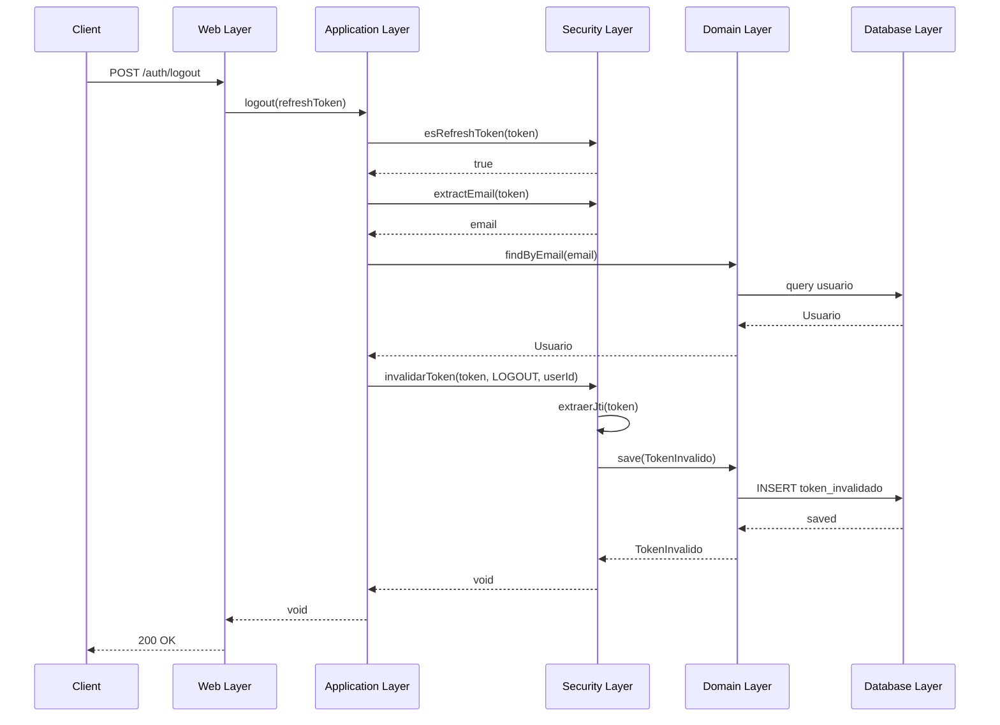

# Migración de Invalidación de Tokens JWT

## Resumen
Migración completada de la funcionalidad de invalidación de tokens JWT desde `seguridad-back` a `security-backend`, siguiendo los principios de la arquitectura hexagonal.

## Fecha de Migración
16 de marzo de 2026

## Componentes Implementados

### 1. Domain Layer (Capa de Dominio)

#### MotivoInvalidacionToken (Enum)
**Ubicación:** `domain/src/main/java/com/matias/domain/model/MotivoInvalidacionToken.java`

Enum que define los motivos por los cuales un token puede ser invalidado:
- `LOGOUT`: Usuario realizó logout manualmente
- `CAMBIO_PASSWORD`: Usuario cambió su contraseña
- `ROTACION`: Token rotado por políticas de seguridad
- `USUARIO_BANEADO`: Usuario fue baneado o bloqueado

#### TokenInvalido (Modelo)
**Ubicación:** `domain/src/main/java/com/matias/domain/model/TokenInvalido.java`

Modelo de dominio que representa un token JWT invalidado:
- `id`: Identificador único
- `jti`: JWT ID (claim único del token)
- `motivo`: Razón de la invalidación
- `fechaInvalidacion`: Timestamp de invalidación
- `fechaExpiracion`: Fecha de expiración del token original
- `usuarioId`: ID del usuario asociado

#### TokenInvalidoRepositoryPort (Puerto)
**Ubicación:** `domain/src/main/java/com/matias/domain/port/TokenInvalidoRepositoryPort.java`

Interfaz que define el contrato para el repositorio de tokens invalidados:
- `save(TokenInvalido)`: Guardar un token invalidado
- `existsByJti(String)`: Verificar si un token está invalidado
- `eliminarTokensExpirados(Instant)`: Limpiar tokens invalidados expirados

### 2. Database Layer (Adaptador de Persistencia)

#### TokenInvalidoEntity
**Ubicación:** `database/src/main/java/com/matias/database/entity/TokenInvalidoEntity.java`

Entidad JPA que mapea la tabla `tokens_invalidados`:
```sql
CREATE TABLE tokens_invalidados (
    id BIGINT PRIMARY KEY AUTO_INCREMENT,
    jti VARCHAR(255) UNIQUE NOT NULL,
    motivo VARCHAR(50) NOT NULL,
    fecha_invalidacion TIMESTAMP NOT NULL,
    fecha_expiracion TIMESTAMP NOT NULL,
    usuario_id BIGINT,
    INDEX idx_jti (jti),
    INDEX idx_fecha_expiracion (fecha_expiracion)
);
```

#### TokenInvalidoJpaRepository
**Ubicación:** `database/src/main/java/com/matias/database/repository/TokenInvalidoJpaRepository.java`

Repositorio Spring Data JPA que implementa queries de base de datos.

#### TokenInvalidoMapper
**Ubicación:** `database/src/main/java/com/matias/database/mapper/TokenInvalidoMapper.java`

Mapper bidireccional entre `TokenInvalido` (dominio) y `TokenInvalidoEntity` (JPA).

#### TokenInvalidoRepositoryAdapter
**Ubicación:** `database/src/main/java/com/matias/database/adapter/TokenInvalidoRepositoryAdapter.java`

Adaptador que implementa `TokenInvalidoRepositoryPort`, traduciendo entre el dominio y la capa de persistencia.

### 3. Security Layer (Servicios de Seguridad)

#### TokenServicePort (Extensión)
**Ubicación:** `domain/src/main/java/com/matias/domain/port/TokenServicePort.java`

Se agregaron los siguientes métodos al puerto de servicio de tokens:
- `invalidarToken(String, MotivoInvalidacionToken, Long)`: Invalidar un token
- `estaInvalidado(String)`: Verificar si un token está invalidado

#### TokenServiceImpl (Implementación)
**Ubicación:** `security/src/main/java/com/matias/security/jwt/TokenServiceImpl.java`

Implementación de los métodos de invalidación:
- Extrae el JTI del token JWT
- Guarda el token invalidado con su motivo y fechas
- Verifica la existencia de tokens invalidados

### 4. Application Layer (Lógica de Negocio)

#### AuthService.logout()
**Ubicación:** `application/src/main/java/com/matias/application/service/impl/AuthServiceImpl.java`

Implementación del método de logout:
1. Valida que sea un refresh token
2. Extrae el email del token
3. Busca el usuario en la base de datos
4. Invalida el refresh token con motivo `LOGOUT`
5. Registra el evento en logs

#### AuthService.limpiarDatosObsoletos()
Se extendió el método existente para incluir la limpieza de tokens invalidados expirados, ejecutándose diariamente a las 2 AM mediante el scheduler `LimpiezaDatosScheduler`.

## Flujo de Invalidación



## Validación en Requests

El `JwtFilter` debe ser actualizado para verificar tokens invalidados:

```java
// En cada request autenticado
String jti = tokenService.extractJti(token);
if (tokenService.estaInvalidado(jti)) {
    throw new NoAutenticadoException("Token invalidado");
}
```

## Limpieza Automática

La tarea programada `LimpiezaDatosScheduler` ejecuta diariamente a las 2 AM:
- Limpia tokens de verificación de email expirados
- Limpia tokens de reset de password expirados
- **NUEVO:** Limpia tokens invalidados cuya fecha de expiración ya pasó

## Principios de Arquitectura Hexagonal Respetados

✅ **Inversión de Dependencias**: Database depende de Domain, no al revés
✅ **Puertos y Adaptadores**: Interfaces en Domain, implementaciones en Database y Security
✅ **Separación de Responsabilidades**: Cada capa tiene su responsabilidad claramente definida
✅ **Independencia de Frameworks**: El dominio no conoce JPA, Spring, ni detalles técnicos
✅ **Testabilidad**: Los ports permiten fácil mocking para tests unitarios

## Próximos Pasos

1. **Actualizar JwtFilter**: Agregar verificación de tokens invalidados en cada request
2. **Crear Endpoint Web**: Exponer el endpoint `/auth/logout` en `AuthController`
3. **Tests Unitarios**: Crear tests para todos los componentes nuevos
4. **Tests de Integración**: Validar el flujo completo de invalidación
5. **Documentación API**: Documentar el endpoint de logout con Swagger/OpenAPI

## Notas Técnicas

- Los tokens invalidados se almacenan solo hasta su fecha de expiración natural
- El JTI (JWT ID) se usa como identificador único para cada token
- La limpieza automática evita el crecimiento indefinido de la tabla
- La validación debe ser rápida: considerar caché en memoria si el volumen es alto

## Estado de Compilación

✅ **BUILD SUCCESS** - Todos los módulos compilan correctamente
- Domain: ✅
- Application: ✅
- Database: ✅
- Security: ✅
- Email: ✅
- Web: ✅
- App-root: ✅
